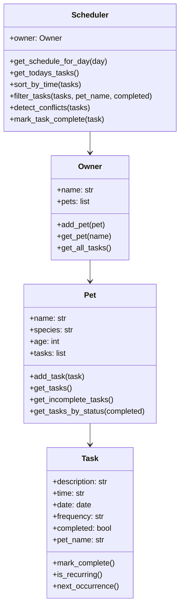

# PawPal+

PawPal+ is a smart pet care management system built with Python and Streamlit. It helps pet owners organize feeding, walks, medications, and appointments using object-oriented design and scheduling logic.

## Features
- Add and manage multiple pets
- Add tasks for each pet
- View today's tasks
- Sort tasks by time
- Detect schedule conflicts
- Automatically reschedule recurring daily and weekly tasks
- Mark tasks as complete through the UI

## Project Files
- `pawpal_system.py` - backend logic layer
- `main.py` - CLI demo script
- `app.py` - Streamlit user interface
- `tests/test_pawpal.py` - automated tests
- `reflection.md` - project reflection
- `requirements.txt` - project dependencies

## UML


## Running the CLI Demo
```bash
python3 main.py
```

## Running the Streamlit App
```bash
streamlit run app.py
```

## Testing PawPal+
```bash
python3 -m pytest
```

Tests cover:
- Task completion
- Task addition
- Sorting by time
- Recurring task creation
- Conflict detection

## Smarter Scheduling
PawPal+ supports:
- sorting tasks chronologically,
- identifying time conflicts,
- filtering tasks by pet or completion state,
- automatically creating the next task instance for recurring daily or weekly care items.

## Reflection
See `reflection.md` for design decisions, tradeoffs, and AI collaboration notes.

## Confidence Level
⭐⭐⭐⭐☆