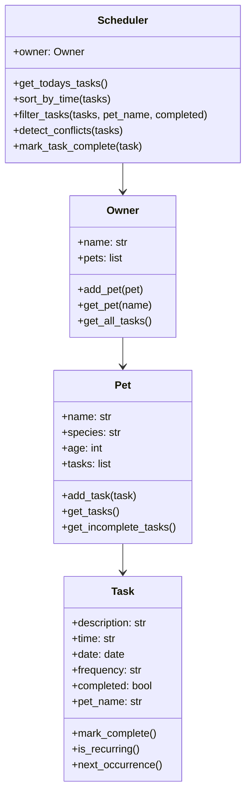

# PawPal+ Project Reflection

## 1. System Design

### a. Initial design

My initial UML design included four main classes: **Owner**, **Pet**, **Task**, and **Scheduler**.  
Each class represented a real‑world entity in the pet‑care domain:

- **Task** handled all information about a scheduled activity, including description, date, time, frequency, and completion status.  
- **Pet** stored basic pet information and maintained a list of tasks.  
- **Owner** acted as the top‑level container for multiple pets and provided access to all tasks across the household.  
- **Scheduler** was responsible for algorithmic logic such as sorting, filtering, retrieving today’s tasks, and detecting conflicts.

The UML diagram showed clear “has‑a” relationships: Owners have Pets, Pets have Tasks, and the Scheduler reads tasks from the Owner. This structure helped me keep responsibilities clean and modular.

### b. Design changes

My design evolved during implementation.  
I used a real `datetime.date` object on the `Task` class instead of just strings, and I kept time in a `"HH:MM"` string format that I convert with `datetime.strptime` when sorting and checking schedules. This made sorting, recurrence, and conflict detection more robust while keeping the code simple. I also thought about adding a `priority` field but decided to leave that for a future iteration so I could keep the core scheduler focused and easy to test.

These changes improved the realism and extensibility of the system, and they aligned better with the project’s goal of building an intelligent scheduler.

---

## 2. Scheduling Logic and Tradeoffs

### a. Constraints and priorities

My scheduler considers several constraints:

- **Time** — tasks are sorted chronologically using `datetime.strptime` on the `"HH:MM"` time string.  
- **Date** — only tasks scheduled for today appear in the daily schedule.  
- **Frequency** — daily and weekly tasks automatically generate their next occurrence.  
- **Conflicts** — tasks with the same date and time are flagged.

I prioritized **time and date** first because they are essential for a functional schedule. Recurrence and conflict detection came next because they add intelligence without overwhelming complexity.

### b. Tradeoffs

One tradeoff is that **conflict detection only checks for exact time matches**, not overlapping durations.  
For example, a 30‑minute walk at 8:00 AM and a grooming appointment at 8:15 AM would not be flagged.

This tradeoff is reasonable because the project focuses on discrete tasks rather than continuous events. Adding duration‑based conflict detection would require more attributes and more complex logic than the scope requires.

---

## 3. AI Collaboration

### a. How you used AI

I used AI throughout the project in several ways:

- **Design brainstorming:** generating UML diagrams and refining class responsibilities.  
- **Implementation:** scaffolding class skeletons, writing method stubs, and filling in logic.  
- **Debugging:** asking why certain tests failed and how to fix them.  
- **Refactoring:** improving readability and making code more Pythonic.  
- **Algorithm design:** comparing different approaches for sorting, recurrence, and conflict detection.

The most helpful prompts were specific ones like:  
*“How should the Scheduler retrieve all tasks from the Owner’s pets?”*  
and  
*“Suggest a clean way to implement daily recurrence using timedelta.”*

### b. Judgment and verification

There were several moments where I didn’t accept AI suggestions immediately.  
For example, one suggestion used string‑based time sorting without converting to `datetime`, which would be fragile once I added recurrence and conflict detection.

To verify suggestions, I:

- Ran the code in my CLI demo  
- Wrote tests to confirm behavior  
- Checked whether the logic aligned with my UML and design goals  

This helped me stay in control of the architecture rather than letting the AI dictate it.

---

## 4. Testing and Verification

### a. What you tested

I tested several core behaviors:

- **Task completion and recurrence** — verifying that daily tasks generate a new task for the next day.  
- **Sorting** — ensuring tasks appear in correct chronological order.  
- **Conflict detection** — confirming that tasks with identical times are flagged.  
- **Task addition** — verifying that adding a task increases a pet’s task list.

These tests were important because they validated the “smart” parts of the scheduler — the parts most likely to break if logic changes.

### b. Confidence

I am confident that the scheduler works correctly for the project’s intended use cases.  
The tests cover the essential behaviors, and the CLI demo plus Streamlit UI both confirm that the logic behaves as expected.

If I had more time, I would test:

- Weekly recurrence  
- Priority‑based sorting (after adding a priority field)  
- Edge cases like invalid times or missing data  
- JSON persistence (if implemented)

---

## 5. Reflection

### a. What went well

I’m most satisfied with the **clean separation between logic and UI**.  
Building the backend first in a CLI environment made the system easier to debug and ensured the Streamlit UI stayed simple and focused.

I’m also proud of the recurrence and conflict detection logic — they make the app feel genuinely intelligent.

### b. What you would improve

If I had another iteration, I would:

- Add duration‑based conflict detection  
- Implement full JSON persistence for saving tasks between sessions  
- Improve the UI with color‑coded priorities and better task tables  
- Add support for multiple days instead of only “today”

### c. Key takeaway

The biggest thing I learned is that **AI is a powerful collaborator, but not a replacement for architectural thinking**.  
AI can generate code quickly, but it’s up to me to decide what belongs in each class, how data should flow, and which algorithms make sense.  
Being the “lead architect” means using AI as a tool — not letting it design the system for me.

## Initial UML

